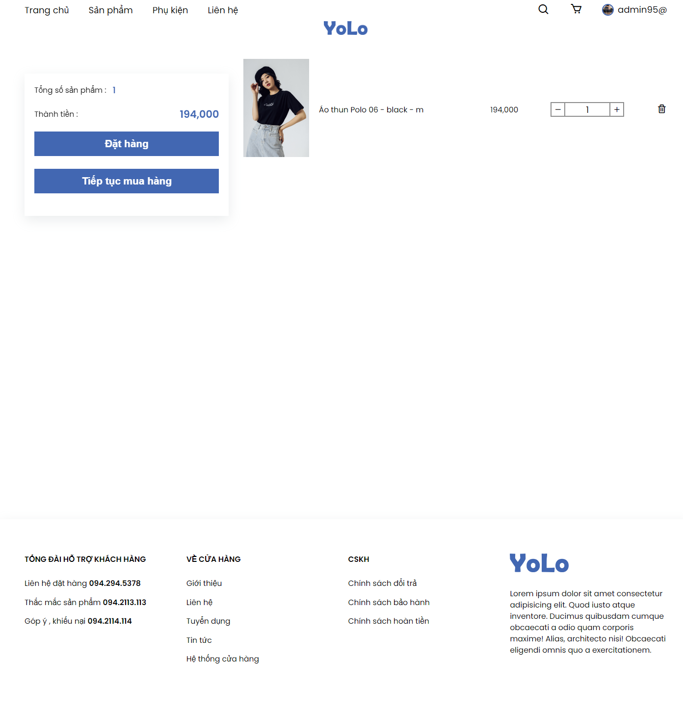

- Project : Website bán hàng thương mại điện tử
- Description : Các công nghệ sử dụng
    + ReactJS , Propstype , Redux , MongoDB , JWT , SCSS 
    Các chức năng bao gồm :
    + Đăng kí / Đăng nhập
    + Thêm giỏ hàng cho mỗi user
    + Preview sản phẩm 
    + Filter sản phẩm
 Để chạy project : 
 B1 khởi động server : node server/index.js
 B2 run project : npm start
 Hoặc mở trực tiếp website tại: 
 https://react-redux-ecom-v6.herokuapp.com/
- Xem ảnh review

<h1>Filter sản phẩm </h1>

<h1> Giỏ hàng </h1>

